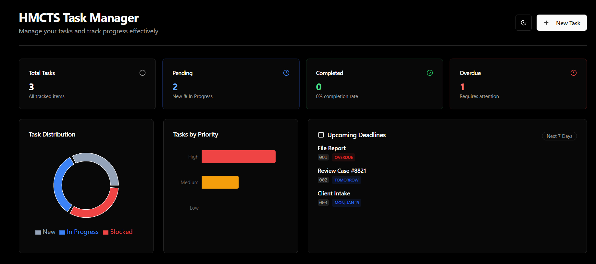
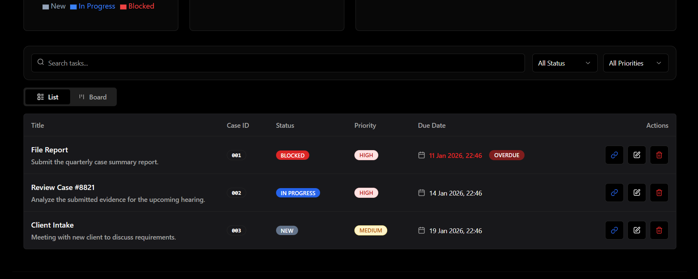
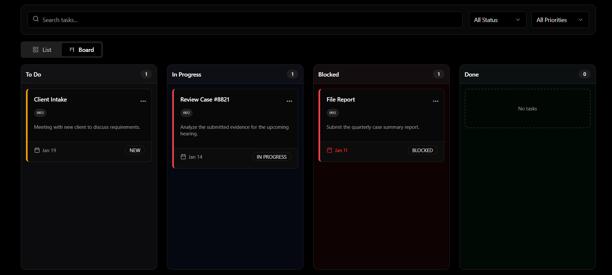
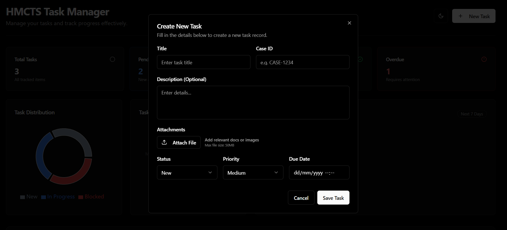
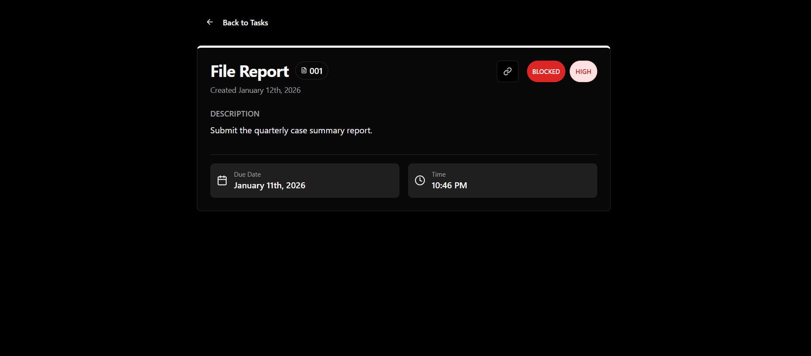

# HMCTS DTS Caseworker Task Manager

## 🚀 Live Demo
**https://hmcts-task-manager.vercel.app/**

## Overview
A comprehensive task management solution designed for HMCTS caseworkers. This application features a modern, dark-themed UI with real-time updates, drag-and-drop Kanban boards, and robust task tracking capabilities.

### Dashboard & Analytics

*Real-time overview of task distribution, priorities, and upcoming deadlines.*

### Task Management
| List View | Kanban Board |
|-----------|--------------|
|  |  |
| *Efficiently filter, sort, and manage tasks in a tabular view.* | *Visualise workflow progress with a drag-and-drop board.* |

### Task Operations
| Create Task | Task Details |
|-------------|--------------|
|  |  |
| *Quickly add tasks with validation, attachments, and priorities.* | *Deep dive into specific task information and history.* |

## Features vs Requirements

| Requirement | Implementation | Status |
|-------------|----------------|--------|
| **Backend API** | Supabase REST API: `/tasks` (CRUD), `/tasks?id=eq.{id}`. Postgres DB with RLS. | ✅ |
| **Create task** | `POST /tasks` with title*, description, status (NEW), due_date_time | ✅ |
| **List/Get/Delete** | `GET /tasks`, `GET /tasks?id=eq.{id}`, `DELETE /tasks?id=eq.{id}` | ✅ |
| **Unit tests** | Service Layer (Vitest), Components (RTL). Total 4+ suites. | ✅ |
| **Database** | Supabase Postgres (production-ready, schema auto-migrated). | ✅ |
| **Validation** | Zod schemas: title required, valid status enum, date validation. | ✅ |
| **Error handling** | Service layer error propagation, UI toast notifications (sonner). | ✅ |
| **API Docs** | See `API_DOCS.md` for detailed endpoint mapping. | ✅ |
| **Frontend** | React + Tailwind (Shadcn UI): List, create/edit forms, status badges, overdue highlights. | ✅ |

## Quick Start

### Prerequisites
- Node.js 18+
- A Supabase project

### Setup
1. **Install Dependencies**
   ```bash
   npm install
   ```

2. **Configure Environment**
   Create a `.env` file in the root directory:
   ```env
   VITE_SUPABASE_URL=your_supabase_project_url
   VITE_SUPABASE_ANON_KEY=your_supabase_anon_key
   ```

3. **Database Setup**
   Run the SQL script found in `SUPABASE_SETUP.sql` in your Supabase SQL Editor.
   *Note: This script handles Table creation, Enum types, and RLS policies.*

4. **Run Development Server**
   ```bash
   npm run dev  # http://localhost:8080
   ```

5. **Run Tests**
   ```bash
   npm test
   ```

## Architecture & Bonus Points
- **Architecture**: Clean separation of concerns (Service Layer vs UI Components).
- **Type Safety**: Full TypeScript integration with shared types.
- **UX**: Responsive design with dark mode support (Pure Black theme).
- **Testing**: Comprehensive unit tests for Services and UI Components.
- **Kanban Board**: Drag-and-drop style visualization of tasks by status.
